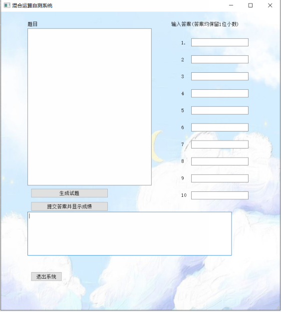
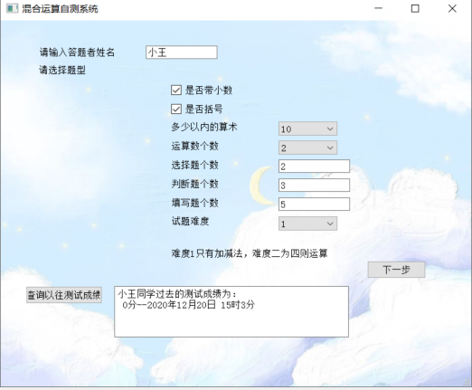
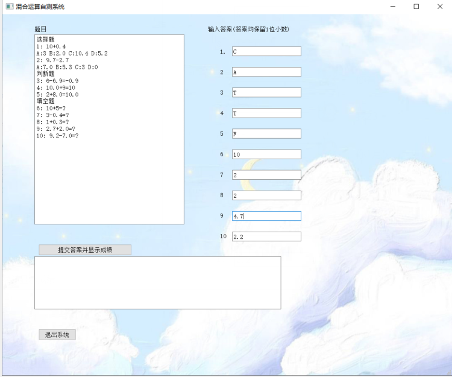
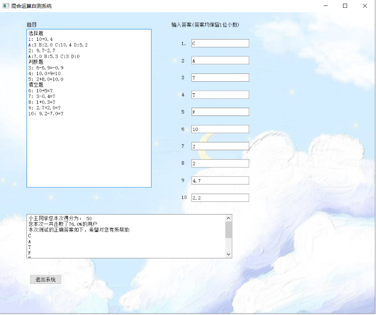

# Mixed-computing-self-test
小学生四则运算自测包括填写结果、对错判断、选择题等。可选择难度  
entrence 为程序入口也是第一个界面  
  
examination为第二个界面(作答评价)  
  
完整的流程:  
1.输入姓名并选择难度：(若查询成绩则点击查询：否则进入下一步)  
  
2.点击生成试题并作答：  
   
3.提交成绩：  
 
